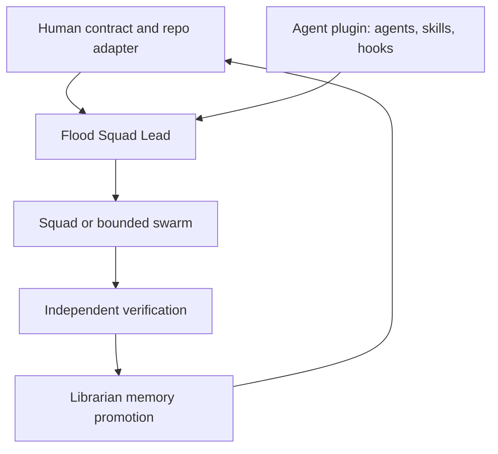

# v0.2 Architecture

Project Flood separates reusable capability from repository-owned truth.

## Layers

| Layer | Contents | Ownership |
| --- | --- | --- |
| Plugin | Namespaced agents, portable `flood-*` skills, deterministic hook code | Project Flood release |
| Repository adapter | `AGENTS.md`, scoped instructions, policy, setup workflow, routing and profile | Target repository |
| Canonical memory | Markdown body plus YAML frontmatter | Flood Librarian under human policy |
| Derived state | `memory-index.yaml` | Generator; never canonical |
| Runtime state | Local task/audit JSON plus activated Git-common-dir lease | Current sessions; never committed |

Full mode vendors the plugin and adapter into one repository. Adapter mode omits workspace agents, skills, and hooks and expects the installed plugin to provide them. Do not enable the plugin in a full-mode workspace because plugin and workspace hooks run together.

## Execution topology

- Direct mode handles a small verified fact.
- Squad mode is the default sequential maker-checker workflow.
- Read-only subagents handle independent research or review.
- Build swarms use separate worktree-backed sessions, a validated runtime manifest, disjoint ownership, and at most three active workers in a wave.
- Flood Integrator performs fan-in only after each workstream passes its own checks. The integrated result is verified again.

The prompt files are local VS Code shortcuts. Skills are the portable workflow authority.
